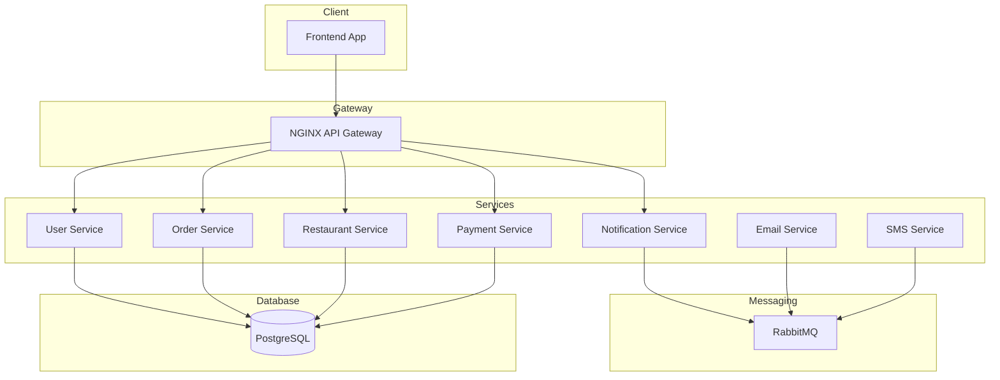

<a href="cravedrop.logo">
  
</a>

# **CraveDrop Delivery**
> ***Food ordering and delivery platform built with microservices architecture.***

---
[](https://hub.docker.com/)
[](https://kubernetes.io/)
[](./LICENSE)
[](https://www.postgresql.org/)
[](https://www.rabbitmq.com/)

**CraveDrop** is a food ordering and delivery platform built with microservices architecture, enabling users to place orders, track deliveries, and interact with restaurants seamlessly.

- [CraveDrop Delivery](#cravedrop-delivery)
  - [Features](#features)
  - [Architecture](#architecture)
  - [CI/CD](#cicd)
  - [Getting Started](#getting-started)
    - [Prerequisites](#prerequisites)
    - [Setup](#setup)
  - [API Documentation](#api-documentation)

## Features

- **User Management**: User authentication and profile management
- **Order Management**: Place, track, and manage orders
- **Restaurant Management**: Browse and filter restaurants
- **Delivery Management**: Manage delivery service
- **Payment Integration**: Secure order payments
- **Real-time Notifications**: Email and SMS updates via RabbitMQ

## Architecture

- Microservices (Node.js, Go, etc.)
- RabbitMQ for messaging
- PostgreSQL for data storage
- Docker + Kubernetes for deployment
- API Gateway with NGINX



## CI/CD

We use **GitHub Actions** to automate building and pushing Docker images.

- **Trigger**: 
  - On **tag push** matching `v*.*.*` (e.g., `v1.0.0`)
  - Manual trigger via **workflow_dispatch**

- **Steps**:
  1. Checkout repository
  2. Log in to **GitHub Container Registry** (GHCR)
  3. Set up **Docker Buildx** and **QEMU** for multi-platform builds
  4. Use **docker-bake-action** to build and push images defined in `docker-bake.hcl`
  5. Images are tagged and pushed to `ghcr.io`

```yaml
on:
  tags:
    - 'v*.*.*'
  workflow_dispatch:
```

```bash
ghcr.io/<your-org-or-username>/<service-name>:<version>
```

> [!NOTE]
> - Images include Git commit SHA labels for traceability.
> - Build cache is enabled via GitHub Actions Cache (`type=gha`) for faster rebuilds.
> - Multi-platform support enabled with QEMU (`amd64`, `arm64`).

## Getting Started

### Prerequisites

- Docker
- Kubernetes (Minikube, Kind, or cloud)
- Kustomize (built into `kubectl` v1.14+)

### Setup

1. Clone the repository:
   ```bash
   git clone https://github.com/your-username/cravedrop-delivery.git
   cd cravedrop-delivery
   ```

2. Build and run locally (optional):
   ```bash
   docker-compose up --build
   ```

3. Deploy to Kubernetes using **Kustomize**:
   ```bash
   kubectl apply -k k8s/kustomization/base
   ```

   > Adjust the path (`overlays/dev`) based on your environment (e.g., `prod`, `staging`).

## API Documentation

- Full API reference: [View on Postman](https://documenter.getpostman.com/view/33227780/2sB2ca8L6c)

## License

MIT License - see [LICENSE](LICENSE) for details.

